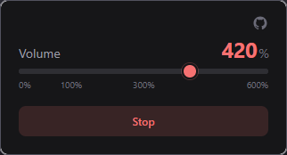

## Volumemaxxing
<p float="left">
<a href="https://example.com/" style="text-decoration: none;">

</a>
</p>

Why another volume booster? Firefox doesn't support capturing tab audio as aggressively as Chromium does. As a result other booster extensions often break on:
- DRM content
- websites doing aggressive stuff like messing with captureStream()
- dynamic audio through
    - Web Audio API
    - Media Source API
    - Audio() constructor
    - WebRTC AudioTrack
    - probably AudioWorklet in the future

This extension tries to overcome most of these issues.

### Building

To build and load the extension from source run:

```
degit Kenrocal/firefox-volumemaxxing extension-folder

pnpm install

pnpm run build

go to about:debugging#/runtime/this-firefox (enable developer mode)

Load Temporary Add-on... extension-folder/.output/firefox-mv3

or

pnpm run zip

```


### Acknowledgements

[Aklinker1](https://github.com/sponsors/aklinker1) making extension development fun:
- [WXT](https://wxt.dev/)
- [webext-core](https://github.com/aklinker1/webext-core)
- [publish-browser-extension](https://github.com/aklinker1/publish-browser-extension)

[Antfu's](https://github.com/sponsors/antfu) really cool projects:
- [eslint-config](https://github.com/antfu/eslint-config)
- [UnoCSS](https://unocss.dev/)
- [unimport](https://github.com/unjs/unimport)

[Svelte](https://svelte.dev/)